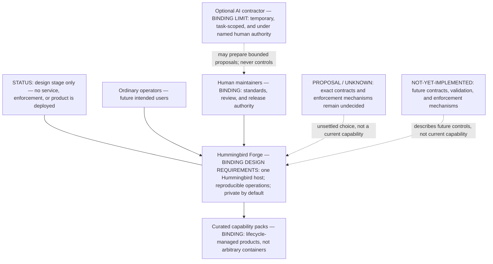
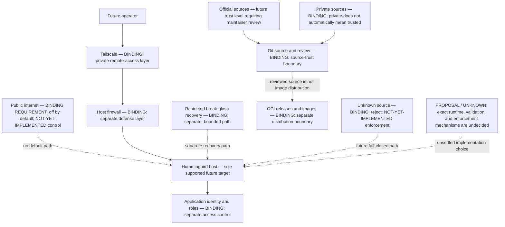
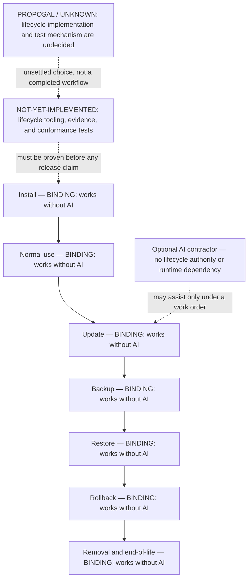
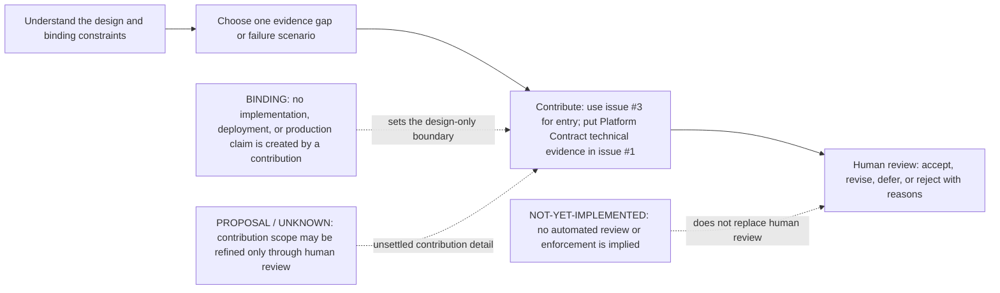

# Hummingbird Forge

> **Design-stage project — not a working product.** No deployment artefacts, production service, tested enforcement, or production-security guarantee exists in this repository.

**A proposed way for ordinary organisations and families to run private collaboration without becoming system administrators: one Hummingbird host, curated capability packs, private-by-default access, and optional AI under human authority.**

## In two minutes

### What it is

Hummingbird Forge is a collaborative **design and evidence** effort for a single-target self-hosting platform. The intended platform would combine a sole supported Hummingbird host with lifecycle-managed capability packs, reproducible operations, and private remote access through Tailscale.

### What it is not

- Not an install guide, deployment project, pack catalogue, container collection, or production service.
- Not a second host, runtime, orchestrator, or hardware support path.
- Not public internet exposure by default.
- Not an AI administrator, approval authority, decision-maker, runtime dependency, or hidden control plane.

### Why this matters

Self-hosting is not only installation. Updates, access, recovery, data portability, and retirement can still demand specialist care. The project asks what a maintained, understandable path would need to prove before anyone relies on it.

### Help shape the design

Start with the **[Platform Contract — issue #1](https://github.com/nissifield/ftlbird-waypoint/issues/1)**, the single technical coordination point. Use the **[community invitation — issue #3](https://github.com/nissifield/ftlbird-waypoint/issues/3)** for community entry or operator discovery; direct Platform Contract technical evidence and failure scenarios to #1. We are seeking design evidence, not implementation work.

## The proposed ecosystem

Diagram summary: future ordinary operators would use Hummingbird Forge and curated packs. Human maintainers retain authority; an optional AI contractor may prepare bounded work but has no authority over the platform. Every box describes a design requirement or an unimplemented future control, not a deployed service.

**Reading key:** labels beginning **BINDING** are requirements for any future implementation. **NOT-YET-IMPLEMENTED** means no current control is claimed. Where a choice is unsettled, it is identified as a proposal or unknown in the [architecture guide](docs/architecture.md) and [issue #1](https://github.com/nissifield/ftlbird-waypoint/issues/1).

## Boundaries to test, not claims to trust

Diagram summary: Tailscale is the intended private remote-access layer. It is deliberately separate from a host firewall, application identity/roles, and restricted break-glass recovery. Git review and OCI distribution are distinct future trust boundaries. Public internet exposure is required to be off by default; this is not yet an implemented control.

The diagram records future requirements only. It does not assert that Tailscale, firewalling, identity controls, provenance checks, or recovery mechanisms have been installed, integrated, tested, or enforced.

## Lifecycle must remain AI-free

Diagram summary: any future capability pack must support the entire lifecycle without AI. The optional AI contractor is intentionally outside the lifecycle and cannot become a control path. None of these workflows is implemented or tested yet.

The lifecycle is a design acceptance bar, not an availability claim. [Issue #1](https://github.com/nissifield/ftlbird-waypoint/issues/1) asks contributors to define observable evidence for clean restore, migration, rollback, removal, outage, and restricted recovery.

## Start here

| If you are… | Read | First small action |
| --- | --- | --- |
| A potential operator or pilot user | [Architecture guide](docs/architecture.md) and [issue #3](https://github.com/nissifield/ftlbird-waypoint/issues/3) | Share one anonymised collaboration task that is difficult today and what a future solution would have to prove. |
| A security or supply-chain reviewer | [SECURITY.md](SECURITY.md) and [issue #1](https://github.com/nissifield/ftlbird-waypoint/issues/1) | Add one hypothetical trust-boundary failure and the evidence or test needed to reject it. Do not post sensitive findings. |
| A platform or lifecycle engineer | [Architecture guide](docs/architecture.md) and [issue #1](https://github.com/nissifield/ftlbird-waypoint/issues/1) | Identify one missing interface, lifecycle failure mode, or acceptance criterion for the Platform Contract. |
| A UX or documentation contributor | [CONTRIBUTING.md](CONTRIBUTING.md) | Point to one unclear statement, name the intended reader, and propose a plainer replacement. |
| A maintainer | [GOVERNANCE.md](GOVERNANCE.md) and [community setup](docs/community-setup.md) | Record one human-reviewed decision, unresolved objection, or evidence gap; keep #1 as the single technical coordination issue. |

## Contributor journey

Diagram summary: contribution is intentionally small and evidence-led. Issue #1 remains the technical coordination point; issue #3 is the invitation. A human maintainer, not AI, reviews and records the outcome.

See [CONTRIBUTING.md](CONTRIBUTING.md) for the evidence standard and safe contribution boundaries. Do not open another umbrella issue for the Platform Contract.

## Binding design requirements

The following are commitments for future implementation, **not claims that controls already exist**:

1. **One supported host:** Hummingbird is the sole supported host target unless maintainers make an explicit architecture decision.
2. **Private remote access:** Tailscale is the private remote-access layer; public exposure is off by default. It does not replace host firewalling, application authentication/roles, or restricted break-glass recovery.
3. **AI-free core operations:** install, normal use, updates, backup, restore, rollback, removal, and end-of-life must work without AI.
4. **Lifecycle-managed packs:** every capability pack is a maintained product with declared provenance, compatibility, support, privileges, data handling, and its complete lifecycle.
5. **Reproducible durable state:** lasting changes must be versioned configuration, controlled migrations, or derived images—not unmanaged in-container edits.
6. **Separate supply-chain boundaries:** Git holds source and review history; OCI registries distribute releases and images. Official and private sources require distinct trust treatment; unknown sources must be rejected.
7. **Human authority and untrusted input:** maintainers set standards and approve releases. Model output and retrieved content are untrusted; AI cannot approve its own work.

## Project map

- [Architecture guide](docs/architecture.md) — known constraints, proposals, and unknowns.
- [Platform Contract — issue #1](https://github.com/nissifield/ftlbird-waypoint/issues/1) — the single technical coordination point.
- [Community invitation — issue #3](https://github.com/nissifield/ftlbird-waypoint/issues/3) — one evidence gap or failure scenario per contributor.
- [Contribution guidance](CONTRIBUTING.md) — evidence-led, issue-first contribution workflow.
- [Governance](GOVERNANCE.md) — human authority and decision records.
- [Security reporting](SECURITY.md) — safe handling for sensitive concerns.
- [Community setup](docs/community-setup.md) — repository labels and forum proposals, not completed configuration.
- [Presentation rationale](docs/repository-presentation-rationale.md) — how this landing page avoids overclaiming.

## Licensing status — human review pending

**CONFLICT / pending decision:** the default branch currently has no `LICENSE` file and its [licensing decision record](docs/decisions/0001-licensing.md) says no licence is selected. In contrast, [issue #2](https://github.com/nissifield/ftlbird-waypoint/issues/2) records a GPL-3.0-only direction and draft [PR #4](https://github.com/nissifield/ftlbird-waypoint/pull/4) proposes the licence text and aligned wording.

**Canonical source of truth:** the human-reviewed, merged default branch. Until a human resolves and merges or rejects PR #4, contributors should not treat the draft PR or issue as an effective licence change. Design discussion is welcome; follow the current [contribution guidance](CONTRIBUTING.md) before submitting material.
